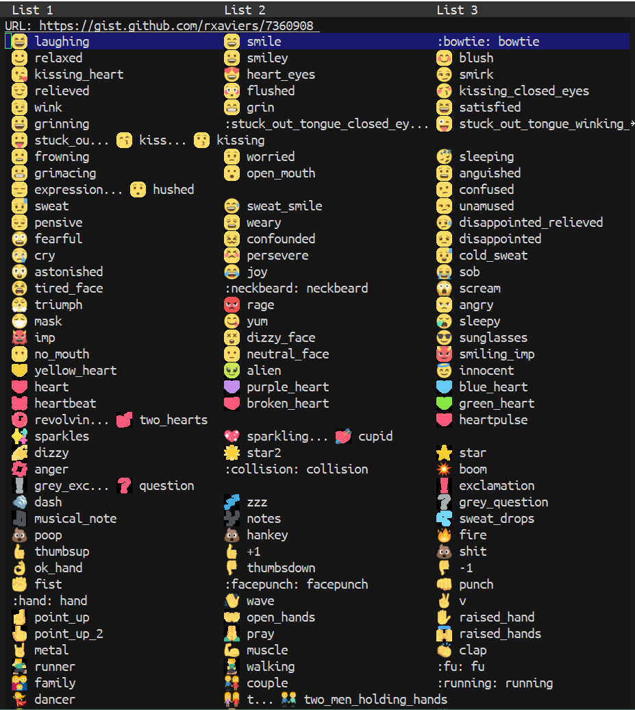

[](https://travis-ci.com/jcs090218/emoji-github)
[](https://www.gnu.org/licenses/gpl-3.0)

# emoji-github
> Display list of GitHub's emoji.  (cheat sheet)

<p align="center">

</p>

## Usage

Simply call this function from minibuffer.

```
M-x emoji-github
```

## Contribution

If you would like to contribute to this project, you may either
clone and make pull requests to this repository. Or you can
clone the project and establish your own branch of this tool.
Any methods are welcome!
